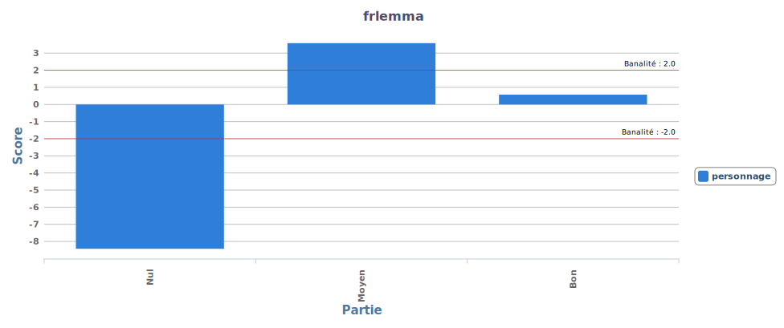

# Recherches sur les séries

Groupe : Erna, ohaila, Nidia, Justine, Mathilde

## Introduction

## Objectifs

Notre objectif était d'analyser le corpus et les éléments linguistiques détemrinants selon les notes attribuées. Cela relève donc de l'analyse de sentiment mais nous avons simplement fait une analyse exploratoire des éléments notables.

Nous avons donc mis en lumière pour chaque partition du corpus ses caractéristiques propres.

## Corpus

### Extraction du corpus

Le corpus est extrait du site [SensCritique](senscritique.fr) qui regroupe des critiques d'oeuvres diverses, autant des films que des albums musicaux en passant par les bandes dessinées. Chaque commentaire est une critique sur une oeuvre en particulier et est accompagné d'une note attribuée par l'auteur de la critique. Dans l'objectif initial de faire de l'apprentissage automatique à partir de ce corpus, l'utilisation de ce site permettait d'avoir un commentaire et en même temps la note pour vérification des résultats obtenus.

Le script d'extraction est [disponible](https://github.com/Bakaeru/SensCritiqueInalco/blob/master/sc_extractor.py) dans ce git.

### Corpus détaillé

Nous avons travaillé sur les séries en particulier, on a donc récupéré uniquement les critiques de séries et le corpus a été partitionné selon les notes dans 3 catégories :

- négatif : notes de 1 à 3
- neutre : notes de 4 à 7
- positif : notes de 8 à 10

## Analyse Exploratoire

### Méthode

Afin de repérer les éléments discriminants pour chaque sous-partition, nous avons réalisé une analyse exploratoire. Cette analyse a été menée sur le logiciel de textométrie TXM. Nous avons analysé les différentes vues du corpus qu'offre TXM et effectué des recherches sur les occurrences desmots et leurs co-occurrents ainsi que plusieurs calculs de spécificités.

### Remarques générales

#### Taille et répartition du corpus

Avant toute chose, nous remarquons que le nombre de mot est assez inégal entre les critiques positives, neutres et négatives.

On peut penser que cela montre que les critiques positives sont plus verbeuses que les critiques négatives.

On note aussi que toutes les séries n'ont pas le même nombre de critiques :

#### Répartition générale des mots

"nous" est représentatif du corpus positif.

Les connecteurs et marques d'opposition ou de concessions sont principalement utilisé dans les critiques positives :

- mais : 4, 5, 6, 7
- alors que : 7,8,9,10

Cela confirme l'idée d'un discours plus construit dans les critiques positives.

### Les personnages et acteurs

On parle des "personnages" si la série est neutre (note entre 4 et 7) et des "acteurs" si la série est bonne (notes entre 8 et 10).

On constate avec les expresisons régulières que la recherche de type EN+est+ADJ renvoie des phrases sur les acteurs et personnages et on obtient principalement des adjectifs positifs. C'est une spécificité des critiques positives se référants aux acteurs.

cooccurrences de ‘principal’ : personnage, acteur, jeu, grand, bonne, super, rôle, intérêt, charisme.

La liste des coocurrents de "principal" confirment que "principal" se rapporte presque exclusivement au "personnage" ou à l'"acteur" principal et les premiers coocurrents sont des mots positifs, on peut affirmer que parler des "acteurs" et des "personnages" est synonyme d'une critique positive, notamment quand on parle des "acteurs".

### Musique et Bande son

## Taglines (phrases d'accroches)

## REGEX recherchées

1) [frpos="NAM"]+[word=".*"][frpos="ADV" & word=".*ment"][word=".*"]{1,5}
2) [word="[A-Z][a-z]+"]+[word="est"][word=".*"]+
3) [word="[A-Z][a-z]+"]+[word="est"][word=".*"]?[frpos="ADJ"]

## Conclucion
